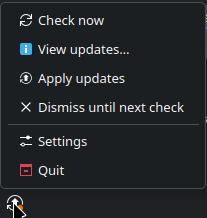
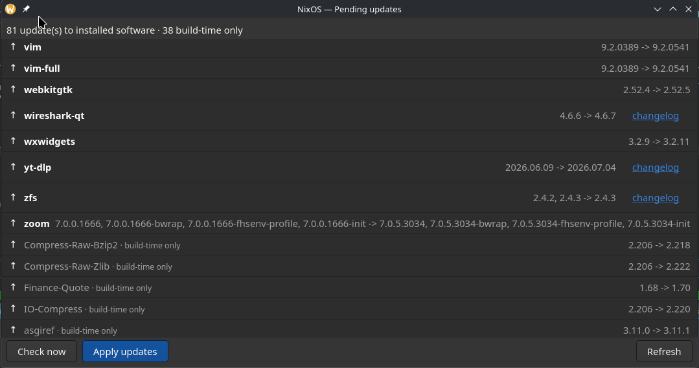
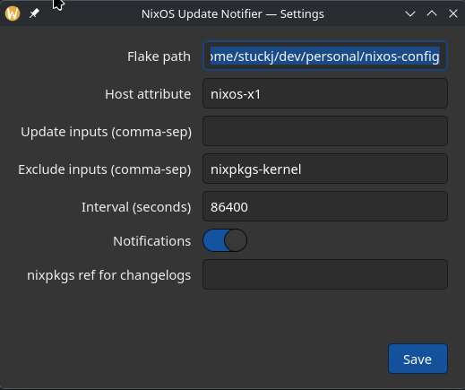

# nixos-update-notifier

A system-tray update notifier for **flake-based NixOS** — the Ubuntu update notifier, but
for NixOS flakes.

It sits in your tray, periodically checks whether advancing your flake inputs would change
your system, shows you a `name: old -> new` package list **without downloading anything**,
and applies updates on request through an authenticated `nixos-rebuild`.

Built for **KDE Plasma 6 on Wayland** (native StatusNotifierItem tray).



Everything is driven from the tray menu.



The update list separates **updates to software you actually have installed** from
**build-time-only** dependencies — compilers and build inputs that a derivation-closure
diff necessarily includes but which are never installed on your system. Changelog links
appear where nixpkgs provides `meta.changelog`.



Settings are editable from the tray, or in `config.toml` directly.

---

## Features

- **Tray icon** that reflects state: up to date / checking / updates available / error.
- **Background checks** on a configurable interval that **download nothing** — no package
  builds are fetched just to tell you an update exists.
- **Desktop notifications** when new updates appear.
- **Update list** showing each change as `name: old -> new`, with a changelog link where
  nixpkgs provides one.
- **Apply** from the menu: installs the new `flake.lock` and runs `nixos-rebuild switch`
  behind a polkit prompt, then tells you if a reboot is warranted.
- **Pinned inputs are never advanced** — an `exclude_inputs` list protects things like a
  rev-pinned `nixpkgs-kernel` that provides your kernel + ZFS.
- Fully config-driven; nothing is hardcoded to a particular machine.

---

## Requirements

- NixOS managed as a flake, rebuilt with `nixos-rebuild switch --flake <path>#<host>`.
- A running **StatusNotifierHost** — KDE Plasma provides one; on wlroots compositors use
  something like `waybar`.
- `nix` with flakes enabled, and `polkit`/`pkexec` for applying updates.

---

## Install

The flake exposes `packages.<system>.default`, a **home-manager module**, a **NixOS
module**, and a devShell.

### 1. Add it as a flake input

```nix
# in your system flake.nix
{
  inputs = {
    nixpkgs.url = "github:NixOS/nixpkgs/nixos-unstable";
    home-manager.url = "github:nix-community/home-manager";

    nixos-update-notifier.url = "github:stuckj/nixos-update-notifier";
    nixos-update-notifier.inputs.nixpkgs.follows = "nixpkgs";
  };
}
```

The `follows` line is worth keeping. This flake tracks `nixos-unstable` for its own dev
shell and CI; `follows` points its nixpkgs at yours so you don't evaluate a second nixpkgs
tree — a duplicate glibc, GTK4 and everything beneath them — just to install one tool.

Both modules already build the package from *your* `pkgs`, so the module path is unaffected
either way; `follows` matters when you reference `packages.<system>.default` directly. Any
channel works — the package is tested against stable `nixos-26.05` as well as unstable.

If you'd rather have it as an ordinary package attribute, apply the overlay:

```nix
nixpkgs.overlays = [ inputs.nixos-update-notifier.overlays.default ];
# then: pkgs.nixos-update-notifier
```

To run from a local clone instead:

```nix
nixos-update-notifier.url = "git+file:///home/you/dev/personal/nixos-update-notifier";
# or: "path:/home/you/dev/personal/nixos-update-notifier"
```

### 2. Enable the home-manager module

This is the main way to use it — the tray is a per-user thing.

```nix
{ inputs, ... }:
{
  imports = [ inputs.nixos-update-notifier.homeManagerModules.default ];

  services.nixos-update-notifier = {
    enable = true;
    flakePath = "/home/you/dev/personal/nixos-config";
    hostAttr = "nixos-x1";

    # Advance everything EXCEPT a rev-pinned input:
    excludeInputs = [ "nixpkgs-kernel" ];
    # …or allow-list specific inputs instead:
    # updateInputs = [ "nixpkgs" "home-manager" ];

    interval = 21600;   # seconds (6h)
    notify = true;
  };
}
```

That installs both binaries, writes `~/.config/nixos-update-notifier/config.toml`, and runs
a user systemd service tied to your graphical session.

### 3. Optional: the NixOS module

Only needed to install the package system-wide, or to grant passwordless apply (read
[Security](#security) first — it is off by default for good reason).

```nix
{ inputs, ... }:
{
  imports = [ inputs.nixos-update-notifier.nixosModules.default ];
  services.nixos-update-notifier.enable = true;
}
```

---

## Configuration

The home-manager module generates the config for you. Running standalone, copy
[`config.example.toml`](config.example.toml) to
`~/.config/nixos-update-notifier/config.toml`.

| Option | Meaning |
|---|---|
| `flake_path` | Absolute path to your flake repo. **Required.** |
| `host_attr` | The `nixosConfigurations.<name>` to build. **Required.** |
| `update_inputs` | Inputs to advance. Empty = all of them, minus the excludes. |
| `exclude_inputs` | Inputs to **never** advance, e.g. a pinned kernel. |
| `interval` | Seconds between checks (minimum 60). |
| `notify` | Whether to show desktop notifications. |
| `nixpkgs_ref_for_changelogs` | Which nixpkgs to resolve changelog links against. Defaults to the one in the candidate lock — the revision the pending update would install — so links match the version offered and nothing is downloaded to read them. Override only for a flake that names its nixpkgs something else, and pin what you set. |
| `[icons]` | Icon name per state — see the example file before changing. |

Settings can also be edited from the tray's **Settings** window.

---

## Usage

The tray menu covers everything: **Check now**, **View updates…**, **Apply updates**,
**Dismiss until next check**, **Settings**, **Quit**. Left-click opens the update list.

There is also a CLI, useful for scripting or a quick look:

```console
$ nixos-update-notifier check          # one-shot check; downloads nothing
$ nixos-update-notifier check --json   # machine-readable
$ nixos-update-notifier check --exact  # exact runtime diff (this DOWNLOADS: it builds)
```

Force the running daemon to check immediately:

```console
$ systemctl --user kill -s SIGUSR1 nixos-update-notifier.service
```

### Applying updates

**Apply updates** installs the new `flake.lock` into your repo and runs
`nixos-rebuild switch` behind a polkit prompt. Your previous lock is backed up first and
restored automatically if the rebuild fails or you cancel the prompt.

Those backups are written next to your lock as `flake.lock.bak.<epoch>`, and only the
newest three are kept. They are working files, not history — git already records your
previous locks — so add this to your config repo's `.gitignore`:

```gitignore
flake.lock.bak.*
```

If you want to see what a rebuild would do before trusting it:

```console
$ nixos-rebuild dry-activate --flake <repo>#<host>
```

That runs the real activation logic against your running system and reports which units
would start, stop and restart, without switching.

`nixos-rebuild build-vm` boots the new configuration in a VM, which is useful for
software-only changes. Be aware it only virtualises the **root** filesystem: if your config
declares swap, extra filesystems or a hibernation resume device on real hardware (e.g.
generated by disko), the VM will hang waiting for devices that don't exist. Overriding them
for the VM build only:

```nix
virtualisation.vmVariant = {
  swapDevices = lib.mkForce [ ];
  boot.resumeDevice = lib.mkForce "";
  virtualisation = { memorySize = 4096; cores = 4; };
};
```

For a hardware-specific config (ZFS root, disko partitioning), `dry-activate` is usually
the more informative check.

---

## What the states mean

| Tray state | Meaning |
|---|---|
| **Up to date** | Advancing your inputs would not change the system. |
| **Checking** | A check is running. |
| **Configuration changes** | Inputs moved, but no package changed version — usually a module regenerating its config. Safe to apply, not urgent. |
| **Updates available** | One or more packages changed version. The window lists them. |
| **Error** | The check failed; see `journalctl --user -u nixos-update-notifier`. |

A **⚠ input skipped** banner in the update window means one of your flake inputs could not
be advanced (e.g. a local fork whose repo has moved). The rest were still checked — but
"up to date" means less while an input is being skipped, so it is worth fixing.

---

## Security

**One operation needs root:** `nixos-rebuild switch`, which activates the new system.
Everything else — checking, diffing, the tray, notifications, the GTK window — runs as your
normal user. Even downloading and building doesn't need the app to be root, because `nix`
talks to the already-root nix-daemon.

The privileged helper is correspondingly tiny: it takes **no file paths and no pass-through
arguments**, only which flake ref to activate. The new `flake.lock` is written by the
*unprivileged* daemon, since it's your own file. A failed or cancelled apply restores it.

**Before enabling `polkit.passwordlessUsers`, understand this:** root evaluates the flake
in your checkout, and that checkout is writable by you. Anyone who can run code as your user
can edit `flake.nix` and have root execute it at the next apply. That is inherent to
"rebuild my system from my flake" — the same trust you extend running `sudo nixos-rebuild`
from a repo you can edit.

The polkit prompt is what keeps that safe: you're present and approving. **Enabling
passwordless apply removes that check and is equivalent to `NOPASSWD` sudo for that user.**
It's off by default. Only enable it if you'd also be comfortable granting passwordless root.

---

## Troubleshooting

**The tray icon is blank or missing.** The icon names must exist in your icon theme; an
unresolvable name renders as an empty gap with nothing logged. The defaults are Breeze
names. On another desktop, override them under `[icons]` in the config.

**The tray icon never appears at all.** Check a StatusNotifierHost is running — on KDE it's
part of Plasma. Verify the service is up with
`systemctl --user status nixos-update-notifier`.

**The update window says "Daemon not running".** The GTK window is a client; start the
service with `systemctl --user start nixos-update-notifier`.

**Checks fail.** Look at `journalctl --user -u nixos-update-notifier -e`. A common cause is
a flake input that can't be fetched — that now appears as a ⚠ banner naming the input.

**A check takes a long time.** The first check after a reboot evaluates your whole system
config and can take a minute or more. The tray stays responsive throughout.

---

## Contributing

Architecture, internals, and development setup are in
[CONTRIBUTING.md](CONTRIBUTING.md). Release process is in [RELEASING.md](RELEASING.md).

## License

MIT — see [LICENSE](LICENSE).
